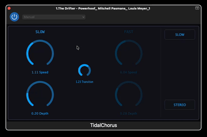

# TidalChorus

**TidalChorus** is a simple chorus effect built around two operating speeds: **SLOW** and **FAST**.

Rather than continuously controlling a single chorus speed, the interface provides two distinct modes and a transition control for moving between them.

  

## Why TidalChorus?

Chorus effects commonly provide continuous control over modulation speed and depth. TidalChorus explores a slightly different interaction:

* **Two distinct speeds:** separate SLOW and FAST chorus settings.
* **Adjustable transition:** the time taken to move between the two modes can be controlled independently.
* **Mode-based interaction:** the interface makes the current modulation mode visually explicit.
* **Stereo capability:** the chorus can operate in either MONO or STEREO mode.
* **Touch-friendly interface:** large controls are used throughout the interface.

The idea is to make changing between two contrasting chorus characters feel more like switching between musical states than adjusting a single continuous parameter.

## What's next?

TidalChorus is currently a small experimental prototype. Further development will explore the interaction, sound, and possible integration of this type of two-state modulation control into other audio effects.

## Current status

TidalChorus is an experimental prototype.

Feedback and suggestions are very welcome.

---

**TidalChorus**
A chorus with two speeds, adjustable transitions, and stereo capability.

<!-- 

ffmpeg -i tidal_demo_vid.mov \
  -vf "fps=7,scale=420:-1:flags=lanczos,split[s0][s1];[s0]palettegen[p];[s1][p]paletteuse" \
  -loop 0 tidal-demo.gif

 -->